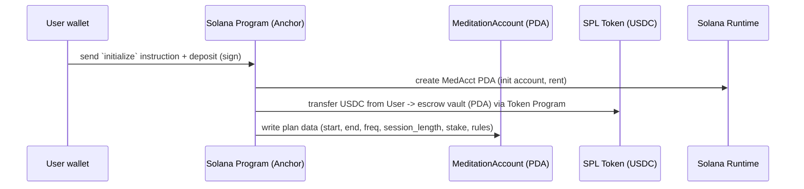
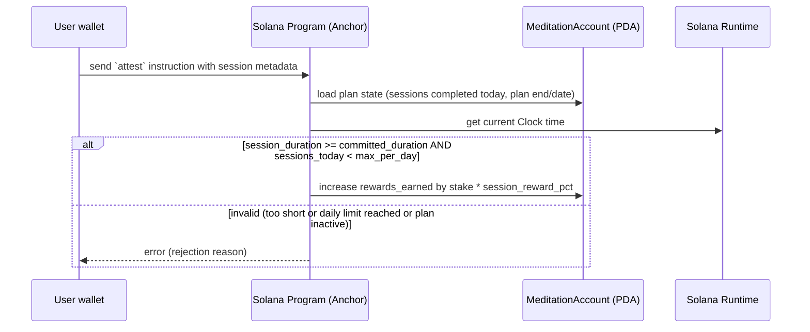
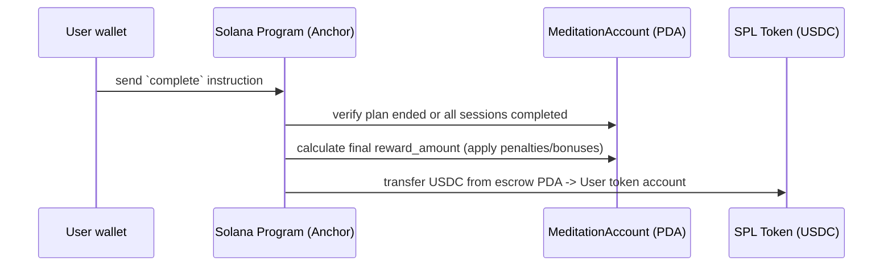

# Architecture Design

# Protocol PoC Requirements

* **Meditation Plan Creation:**
    * The protocol shall allow a user to create a meditation plan, specifying:
        * Plan duration (1-4 weeks)
        * Meditation frequency per day (1-4 times)
        * Individual meditation duration (5-60 minutes)
        * Starting Date and Time (now or in the future)
        * Ending Date and Time (calculated using the plan duration)
        * Rewards earned from completed meditation sessions
        * Penalties incurred from missed meditation sessions
    * The protocol shall allow a user to deposit/stake USDC tokens
    * The protocol shall cap the deposit amount at $500
* **Meditation Session Attestation:**
    * The protocol shall allow a user to submit a meditation attestation, validating:
        * Session duration is greater than or equal to the commitment duration
        * All sessions for the current 24-hour period have not yet been completed
    * The protocol shall update the meditation account to release rewards for each session using a simple percentage
      calculation
* **Penalty Mechanism:**
    * The protocol shall update the meditation account *daily* to incur penalties for missed sessions using the same
      rewards percentage calculation
* **Meditation Plan Completion:**
    * The protocol shall allow a user to see final plan results
    * The protocol shall allow a user to claim rewards earned

# Overview

> See the [Capstone Architecture Design](./Capstone_Architecture_Design.pdf) for diagrams.
> These diagrams were created using Miro and then exported to a Google Doc and then to PDF.
>
> During the development of the MVP, the scope was reduced to remove the reliance on a cron job
> for updating penalties and rewards. Instead, the protocol will update the user's account
> at the end of the meditation plan as part of the complete instruction.

# Meditation Instruction Flow

Here are the sequence diagrams for the three main instructions in the program: `initialize`, `attest`, and `complete`.
These were generated from the Capstone Architecture Design document and are included here for reference.

## 1. initialize

## 2. attest

## 3. complete

